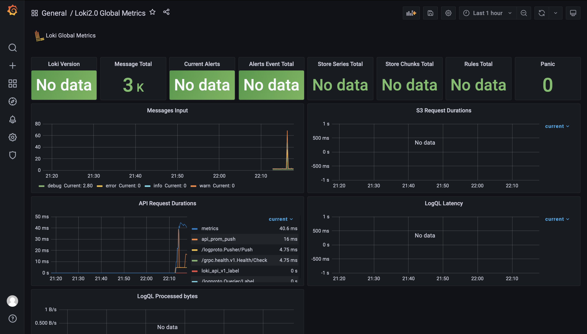

# Logging

## Best practices

- Save logs to storage
- Use log rotation
- Dashboards should have a meaningful names
- Use formatted logs
- Filter logs from sensitive data

## Screenshots

### Grafana

### Promtail

### Prometheus

## Dashboards

### Loki dashboard

### Prometheus dashboard

### Python_app dashboard

